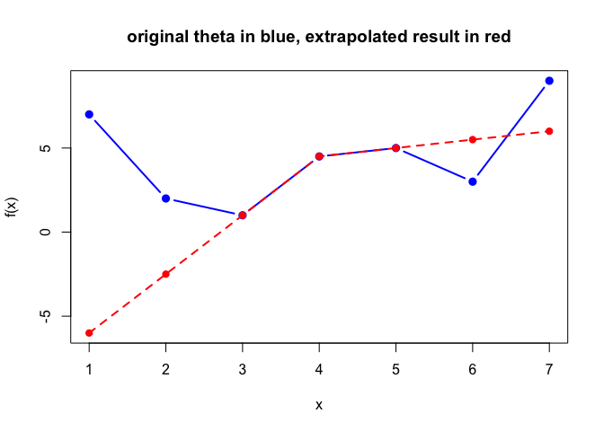

<!-- README.md is generated from README.Rmd. Please edit that file -->

# NaturalSpline

<!-- badges: start -->

<!-- badges: end -->

# Overview

This package provides tools for performing natural spline polynomial
extrapolations on the boundary points of a given input vector **x** and
a given corresponding vector **f(x)**. In methods like **trend
filtering**, boundary points often fail to converge well at the two
ends. This package addresses the issue by replacing the boundary values
with natural spline polynomial extrapolations.

The package includes functions to compute extrapolation matrices and
perform compact and non-compact extrapolations. It is especially useful
for denoising applications where **trend filtering** results in
inaccurate boundary estimates.

------------------------------------------------------------------------

# Core Functions

## Extrapolation Functions

### `extrapolate_compact(x, theta, m, side)`

Performs natural spline extrapolation in a **compact** form using a
formula-based approach.

- **Inputs:**
  - `x`: A numeric vector of inputs.
  - `theta`: A numeric vector corresponding to `f(x)`.
  - `m`: Degree of the polynomial extrapolation.
  - `side`: `"left"` or `"right"` indicating which boundary to
    extrapolate.
- **Output:**
  - A vector of extrapolated values.

### `extrapolate_noncompact(x, theta, m, side)`

Uses matrix multiplication for extrapolation. The matrices are
precomputed from helper functions.

- **Inputs and outputs:** Same as `extrapolate_compact`.

------------------------------------------------------------------------

## Matrix Construction Functions

### `compute_P_matrix(x, m, side)`

Computes the polynomial $`P`$ matrix based on the target and support
points for the specified boundary (`"left"` or `"right"`).

### `compute_C_matrix_withoutTheta(x, m, side)`

Computes the coefficient $`C`$ matrix (without $`\theta`$) using the
natural spline formula.

### `compute_A_matrix(P, C_withoutTheta)`

Combines the $`P`$ matrix and $`C`$ matrix (without $`\theta`$) to
compute the $`A`$ matrix, which will be multiplied with the $`\theta`$)
vector.

------------------------------------------------------------------------

## Visualization

### `plot_extrapolation(x, theta, left_result, right_result)`

Creates a plot comparing the original signal (`x`), the denoised signal
(`theta`), and the extrapolated values at the boundary.

- **Features:**
  - Plots `x` (blue line), `theta` (red line), and extrapolated points
    (green line for the boundary).

------------------------------------------------------------------------

# Usage Example

``` r
library(NaturalSpline)

# Input signal
x <- c( 1, 2, 3, 4, 5, 6, 7)
theta <- c( 7, 2, 1, 4.5, 5, 3, 9)
m <- 2

# Perform extrapolation using different formula
left_result1 <- extrapolate_compact(x, theta, m, side = "left")
right_result1 <- extrapolate_compact(x, theta, m, side = "right")

left_result2 <- extrapolate_noncompact(x, theta, m, side = "left")
right_result2 <- extrapolate_noncompact(x, theta, m, side = "right")

A <- full_A_matrix(x, m)
result3 <- A %*% theta

A_rcpp <- ns_matrix(x, m)
all.equal(A_rcpp, A)
#> [1] TRUE

cat("left_result1: ", left_result1)
#> left_result1:  -6 -2.5
cat(" left_result2: ", left_result2)
#>  left_result2:  -6 -2.5

cat("\nright_result1: ", right_result1)
#> 
#> right_result1:  5.5 6
cat(" right_result2: ", right_result2)
#>  right_result2:  5.5 6

cat("\nresult3: ", result3)
#> 
#> result3:  -6 -2.5 1 4.5 5 5.5 6

# Visualize results
plot_extrapolation(x, theta, m)
```



## Installation

You can install the development version of NaturalSpline from
[GitHub](https://github.com/zhoumo2716/NaturalSpline) with:

``` r
# install.packages("pak")
pak::pak("zhoumo2716/NaturalSpline")
#> ! Using bundled GitHub PAT. Please add your own PAT using `gitcreds::gitcreds_set()`.
#> ℹ Loading metadata database
#> ✔ Loading metadata database ... done
#> 
#> 
#> → Will install 2 packages.
#> → Will update 1 package.
#> → Will download 2 CRAN packages (5.02 MB).
#> → Will download 1 package with unknown size.
#> + NaturalSpline 0.0.0.9000 → 0.0.0.9000 👷🏽‍♀️🔧 ⬇ (GitHub: 1541de8)
#> + Rcpp                       1.0.14      ⬇ (3.36 MB)
#> + RcppArmadillo              14.2.3-1    ⬇ (1.67 MB)
#> 
#> ! NaturalSpline is loaded in the current R session, you probably need to
#> restart R after the installation.
#> 
#> ℹ Getting 2 pkgs (5.02 MB) and 1 pkg with unknown size
#> ✔ Got RcppArmadillo 14.2.3-1 (aarch64-apple-darwin20) (1.67 MB)
#> ✔ Got NaturalSpline 0.0.0.9000 (source) (49.41 kB)
#> ✔ Got Rcpp 1.0.14 (aarch64-apple-darwin20) (3.35 MB)
#> ✔ Installed RcppArmadillo 14.2.3-1  (160ms)
#> ✔ Installed Rcpp 1.0.14  (178ms)
#> ℹ Packaging NaturalSpline 0.0.0.9000
#> ✔ Packaged NaturalSpline 0.0.0.9000 (537ms)
#> ℹ Building NaturalSpline 0.0.0.9000
#> ✔ Built NaturalSpline 0.0.0.9000 (7.3s)
#> ✔ Installed NaturalSpline 0.0.0.9000 (github::zhoumo2716/NaturalSpline@1541de8) (32ms)
#> ✔ 1 pkg + 2 deps: upd 1, added 2, dld 3 (NA B) [16.5s]
```

Or with `devtools`

``` r
# Install the devtools package if not already installed
install.packages("devtools")
#> Installing package into '/private/var/folders/74/4fh__5010_l3tp8fpsft2ft00000gn/T/Rtmp2A8WXV/temp_libpath732236c5f928'
#> (as 'lib' is unspecified)
#> 
#> The downloaded binary packages are in
#>  /var/folders/74/4fh__5010_l3tp8fpsft2ft00000gn/T//RtmpO77bjr/downloaded_packages

# Install the NaturalSpline package from GitHub
devtools::install_github("zhoumo2716/NaturalSpline")
#> Skipping install of 'NaturalSpline' from a github remote, the SHA1 (1541de80) has not changed since last install.
#>   Use `force = TRUE` to force installation
```
